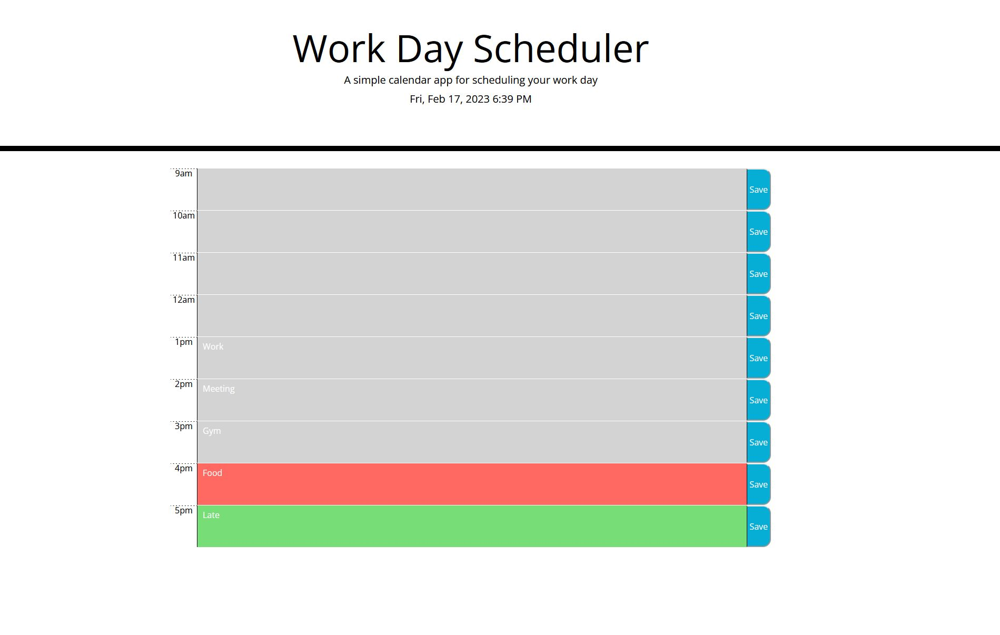

# Third-Party APIs: Work Day Scheduler Challenge

## The Task:

This week I have been tasked to create a simple calendar application that allows a user to save events for each hour of the working day by modifying starter code. This app will run in the browser and feature dynamically updated HTML and CSS powered by jQuery.

I had to use the [Moment.js](https://momentjs.com/) library to work with date and time. Making sure to read the documentation carefully and concentrate on using Moment.js in the browser.

## User Story:

```md
AS AN employee with a busy schedule
I WANT to add important events to a daily planner
SO THAT I can manage my time effectively
```

## Acceptance Criteria

As per the acceptance Criteria The app should:

* Display the current day at the top of the calender when a user opens the planner.
 
* Present timeblocks for standard business hours when the user scrolls down.
 
* Color-code each timeblock based on past, present, and future when the timeblock is viewed.
 
* Allow a user to enter an event when they click a timeblock

* Save the event in local storage when the save button is clicked in that timeblock.

* Persist events between refreshes of a page

The following animation demonstrates the application functionality:


## End Result:

This was the end result of the challenge. 

App displays current day and time at top of app. 

Presents time blocks for working day.

Time blocks are color-coded based on past, present and future events.

User is allowed to enter an event in the time block input field and save it to storage.


Below screenshot shows how the app would behave (I did have to alter times in code for it to work at time of taking screenshot)



## Conclusion:

This was a very fun challenge to work on, I think the result is really good, hopefully matching most of the criteria.This was a hard but fun and educational activity, which naturally boosted my skills as well as confidence. Which will hopefully come useful in the future challenges to come. Tt had also shown that there is still a lot to learn, which I am eager to do.

## Deployment:

* Following is a link to the final version of the Website: 'https://davvid96.github.io/Planner-App/'
